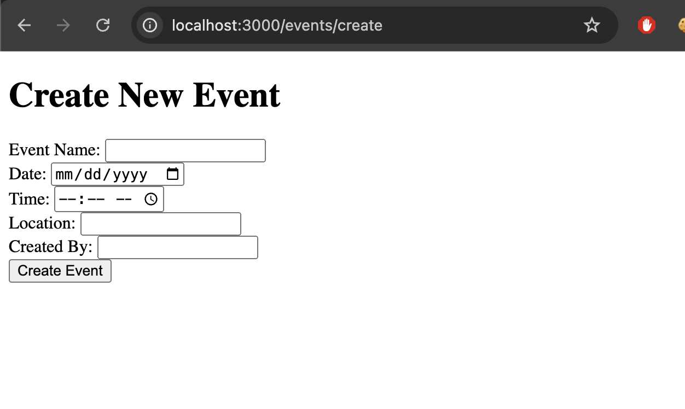
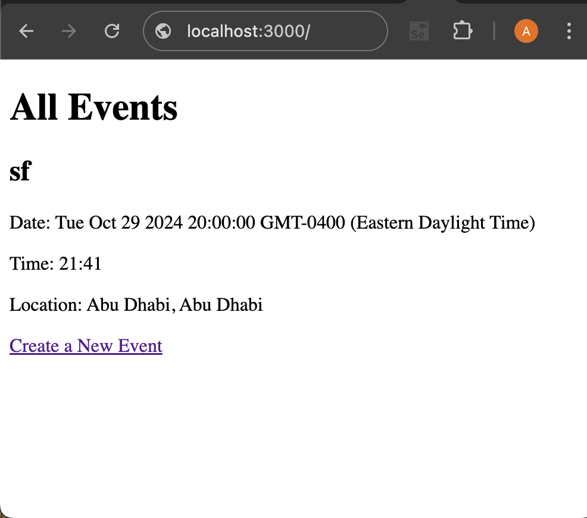

# Event Planner Web Application

## Overview

The Event Planner Web Application is designed to simplify the process of organizing and managing events. Users can add event details, manage guest lists, and keep track of tasks with an embedded checklist. Built using **Express.js**, **MongoDB**, and **hbs**, this app provides a structured and efficient way to plan events.

## Data Model

The application will store details about Events, including the guests and the checklist items associated with each event.

- **Event**: Contains information such as the event name, date, time, location, organizer, guest list, and a checklist of tasks.
- **Guests**: An embedded array within the `Event` schema that includes guest names, emails, and RSVP statuses.
- **Checklist**: Another embedded array in the `Event` schema for tasks, which includes whether each task has been completed.

### Example Documents

**An Example Event Document:**

```json
{
  "name": "Team Building Workshop",
  "date": "2024-11-15T09:00:00.000Z",
  "time": "09:00 AM",
  "location": "Downtown Conference Center",
  "createdBy": "John Doe",
  "guests": [
    { "name": "Alice Johnson", "email": "alice@example.com", "rsvp": "Yes" },
    { "name": "Bob Smith", "email": "bob@example.com", "rsvp": "No" }
  ],
  "checklist": [
    { "task": "Book Venue", "completed": true },
    { "task": "Send Invitations", "completed": false }
  ],
  "createdAt": "2024-10-31T15:45:00.000Z"
}
```

## Link to First Draft Schema

Check out the first draft of the `Event` schema in the [Event.js](./models/event.js) file.

## Wireframes
The wireframes illustrate the design and layout of key pages in the application:

- **Create Event Page**:  
  
  
- **Event List Page**:  
  


## Site Map

The site map outlines the structure of the application:

- **Homepage**: `/`
  - **Event List**: `/events`
    - **Create Event**: `/events/create`
    - **Event Details**: `/events/:id`

## User Stories

The following user stories illustrate how the application will be used:

- As a user, I want to create an event so that I can organize the details in one place.
- As a user, I want to add guests to my event so that I can manage who is invited.
- As a user, I want to create a checklist of tasks so that I can keep track of what needs to be done.
- As a user, I want to view all my events in one place so that I can manage them efficiently.

## Research Topics

The following research topics will be explored, with their assigned point values:

1. **User Authentication (5 Points)**:
   - Implementation using Passport.js to secure access to event management features.
2. **Client-Side Form Validation (4 Points)**:
   - Using a JavaScript library to validate form inputs before submission.
3. **React.js for Frontend (5 Points)**:
   - Creating a dynamic and responsive frontend with React.js.


## Link to Initial Main Project File

The initial setup of the Express application can be found in the [app.mjs](./app.mjs) file.

## Annotations / References Used

Here are the resources and references that were helpful in building this project:

- [Passport.js Documentation](https://www.passportjs.org/docs/) - For implementing user authentication.
- [Mongoose Documentation](https://mongoosejs.com/docs/) - For designing and interacting with the MongoDB data model.
- [hbs Documentation](https://www.npmjs.com/package/hbs) - For using Handlebars as the view engine.